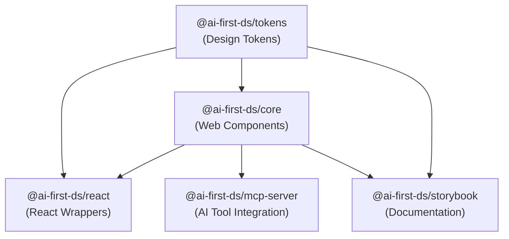
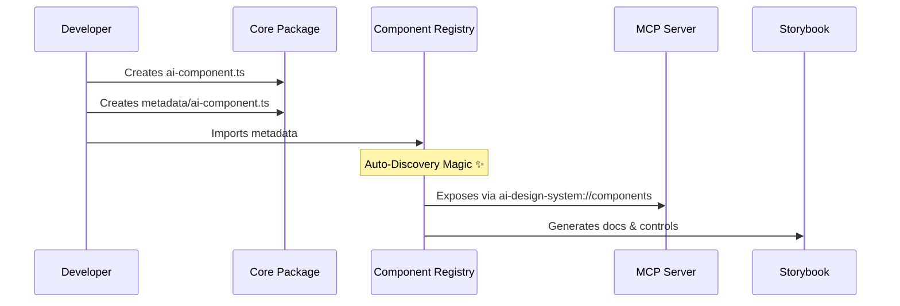

# Project Structure Map

> Visual guide to the AI-First Design System architecture

---

## 📦 Package Relationships



---

## 📂 Directory Structure

### Root Level

```
/
├── .ai/                    # AI-specific documentation & context
├── .github/                # CI/CD, templates, governance
├── docs/                   # Human-readable documentation
├── packages/               # Monorepo workspaces
├── scripts/                # Build & utility scripts
├── examples/               # Usage examples
└── tests/                  # E2E & integration tests
```

### Packages Detail

#### `packages/core` (The Heart)

```
packages/core/
├── src/
│   ├── components/         # Web Components
│   │   ├── ai/             # AI-specific components (ai-*)
│   │   └── base/           # Base components (ai-enhanced)
│   ├── metadata/           # Component metadata system
│   │   ├── component-registry.ts  # Central registry
│   │   └── *.ts            # Individual component metadata
│   ├── tokens/             # Token exports
│   └── utils/              # Shared utilities
└── index.ts                # Main entry point
```

#### `packages/mcp-server` (The Brain)

```
packages/mcp-server/
├── src/
│   ├── index.ts            # Server entry point
│   └── tools/              # MCP tool definitions
└── package.json            # Dependencies
```

#### `packages/tokens` (The DNA)

```
packages/tokens/
├── src/
│   ├── ai-tokens.ts        # AI-specific tokens
│   ├── colors.ts           # Color palette
│   ├── typography.ts       # Type scale
│   └── index.ts            # Token aggregator
└── tailwind.config.js      # Tailwind preset
```

---

## 🔄 Auto-Discovery Flow

How a new component travels through the system:



---

## 🔑 Key Files

| File                                               | Purpose                                |
| -------------------------------------------------- | -------------------------------------- |
| `packages/core/src/metadata/component-registry.ts` | **Source of Truth** for all components |
| `packages/tokens/src/ai-tokens.ts`                 | AI-specific design tokens              |
| `.ai/project-context.md`                           | Context for AI agents                  |
| `docs/research-requirements.md`                    | Research validation standards          |
| `docs/auto-discovery.md`                           | Integration guide                      |

---

## 🛠️ Tooling Ecosystem

- **Build**: Vite (fast, modern bundling)
- **Test**: Vitest (unit) + Playwright (E2E)
- **Lint**: ESLint + Prettier
- **Docs**: Storybook + Markdown
- **AI**: MCP Server + Structured Metadata

---

_See also: [Agent Onboarding](../.ai/agent-onboarding.md), [Auto-Discovery Guide](../docs/auto-discovery.md)_
